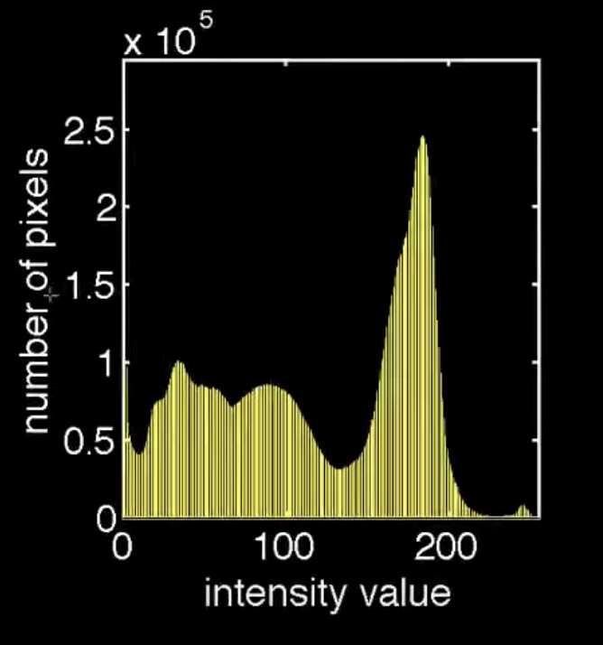
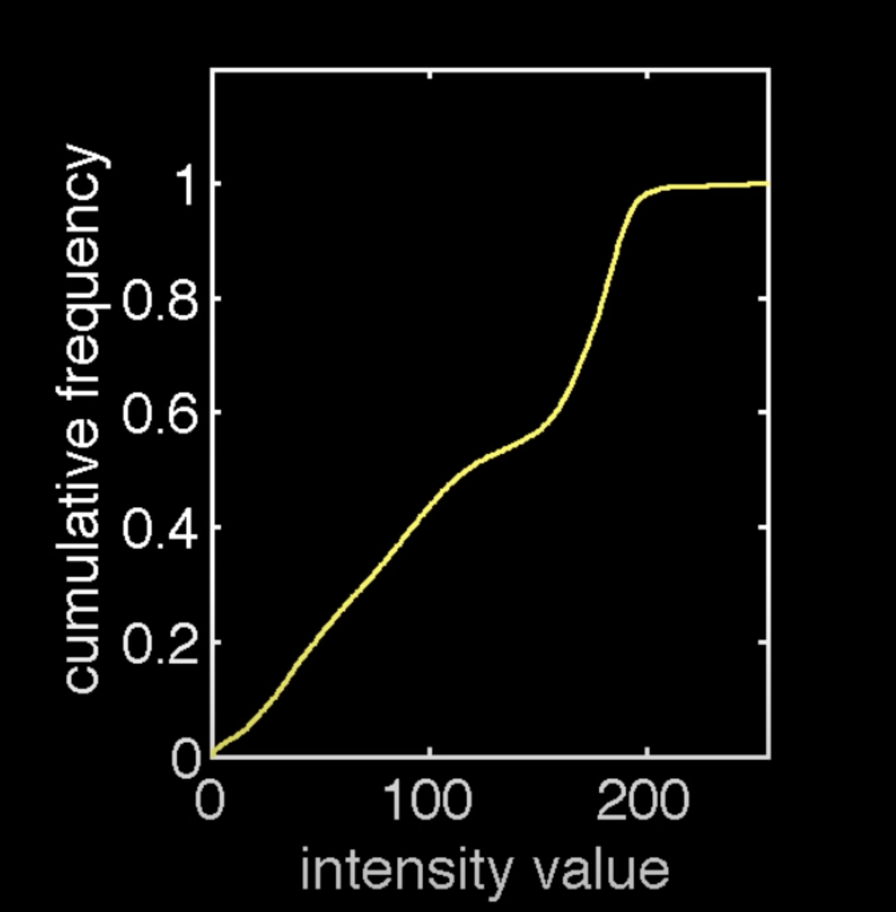

# Histogram Processing 
#### BY
### Saksham Puri
#### E18CSE158

---

# What are histograms?

#### Histograms help us visualise the distribution of the pixels among various intensity levels
#### In a nutshell, they are plots of the number of pixels corresponding to certain intensity level.

---

# Cumulative Frequency

- Cumulative frequency histogram tells us that number of pixels **_less than or equal to_** the corresponding intensity value as opposed to the exact number of pixels at that point.