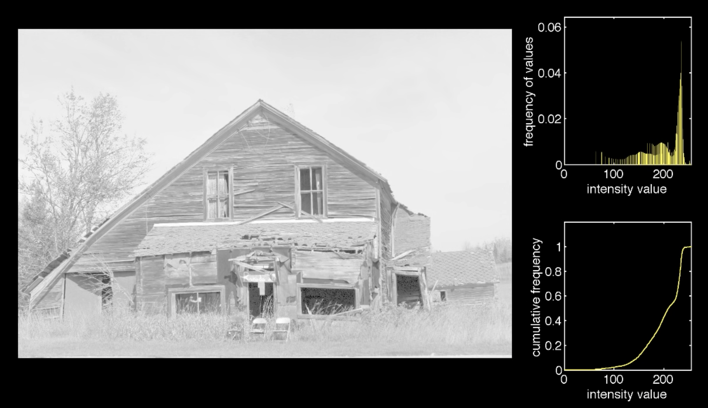

# Histogram Processing 
#### BY
### Saksham Puri
#### E18CSE158

---

# What are histograms?

#### Histograms help us visualise the distribution of the pixels among various intensity levels
#### In a nutshell, they are plots of the number of pixels corresponding to certain intensity level.

---

# Cumulative Frequency

- Cumulative frequency histogram tells us that number of pixels **_less than or equal to_** the corresponding intensity value as opposed to the exact number of pixels at that point.

---

# Lets take an example

The image above has dimensions 5184x3456 or about **18 million** pixels

---

The image is greyscale and each pixel has a range of 0-255

---

We obtain the following histogram of this image

---

This can be further normalised by dividing by the total number of pixels

---

Now we can build a mental model for the cumulative frequency histogram which contains values <= the specific intensity value

---

We can observe the changes in the corresponding plots when we consider different spread of intensity values

---

Here is an example with bright image

---
Low Contrast Example

---

High Contrast Example

---

# histogram equalisation

---

Normal Equalised

---

Dark Equalised

---

Light Equalised

---

Low Contrast Equalised

 

---

Low Contrast Equalised

 

---

# Thank you